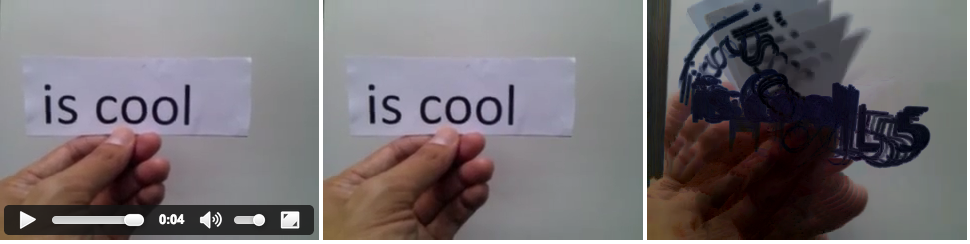

ben welsh wanted to know how [this](http://www.nytimes.com/interactive/2014/06/19/sports/worldcup/goals-from-uruguay-vs-england.html) was done and this is my attempt at figuring out an alternate method. [kevin quealy](https://twitter.com/KevinQ/) mentioned that nyt staffers were at the game with gopro cameras and i assume they've fixed the cameras in place and have them pointed at a single spot on the pitch. otherwise, the image would be incomprehensible because of blurring/shifting artifacts (like the example composite image above).

proof-of-concept, so excuse the ugliness. only tested in webkit. 
